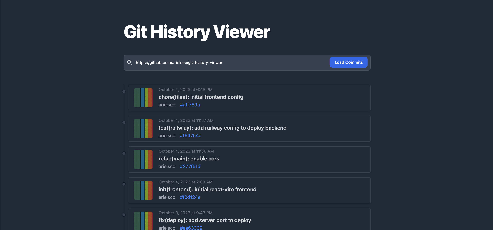

# Git History Viewer

This is a project that is part of the Fulltimeforce programming challenge.


## Description

This repository consists of two directories: `backend` and `frontend`.

```
├── git-history-viewer
│   ├── backend
│   ├── frontend
│   ├── railway.yml
│   └── README.md
```

In this section, the result of the implementation and installation for both projects is described in general.

## Backend

This is the implementation of a backend in NestJs, currently in production on the __railway__ service:

 Libraries used:
- `oktokit`: library for interacting with the GitHub API programmatically.

This is how requests to the endpoint are made:

```url
https://git-history-viewer-production.up.railway.app/commits/{github_user}/{repo}
```

Here is an example of a request:

```bash
curl 'https://git-history-viewer-production.up.railway.app/commits/arielscc/git-history-viewer'
```

### Installation

You can run the project by cloning the repository:

```bash
  git clone https://github.com/arielscc/git-history-viewer.git
  cd git-history-viewer/backend
```

Then, install the dependencies with:

```bash
  yarn install
```

This project depends on an environment variable `.env`, there is an example in the `.env.example` file. Therefore, before running the project, you must run the following command:

```bash
  yarn base
```

This will create an .env file. This file contains a secret token from GitHub that can be obtained from https://developer.github.com/v3/

Finally, you can run the project with the command:

```bash
  yarn start
```

## Frontend

This is the implementation of the frontend with React in Vite. This project is available at:

https://githistory.arielchura.com/




### Installation

You can run the project by cloning the repository:

```bash
  git clone https://github.com/arielscc/git-history-viewer.git
  cd git-history-viewer/frontend
```

Then, install the dependencies with:

```bash
  yarn install
```

Copy the sample environment variable with the command:

```
  yarn base
```

You can use the default configuration or the one you have configured in the backend project, for example:

```bash
  VITE_GIT_COMMITS_URL=https://git-history-viewer-production.up.railway.app

  o

  VITE_GIT_COMMITS_URL=http://localhost:3000
```

Finally, you can run the command:

```bash
  yarn dev
```
